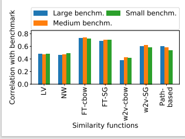

# IdBench工具复现

## 1.工具简介

​        IdBench通过对500名开发人员展示真实的标识符和代码片段，要求他们对语义关系进行评分。IdBench将开发人员评估作为金标准（gold standard），通过测量语义表示与开发人员给出的评分的一致程度，系统地评估语义表示。

方法理解PPT在`ppt`文件夹下

运行视频地址：[工具复现_哔哩哔哩_bilibili](https://www.bilibili.com/video/BV1XM4y1A7ai/)

## 1.数据集

​        IdBench工具的数据由众包调查得到，因此直接使用原文作者调查整理后得到的标识符对的数据集按照数据清理期间使用的阈值不同。将分为`large_pair_wise.csv`, `medium_pair_wise.csv`, `small_pair_wise.csv`

​		数据集中包含了标识符对id，标识符对相似性，相关性，上下文相关性的gold standard，不同语义表示下标识符对的相似性。

## 2.运行及结果验证：

在`compute_correlations.py`的Edit Run Configuration 中设置运行参数

`--small small_pair_wise.csv --medium medium_pair_wise.csv --large large_pair_wise.csv`

运行main函数，将在文件夹中出现**三个pdf文件**分别对应标准 与语义表示的相似性，相关性，上下文相似性的可视化图表，如下

与原论文中的结果一致

## 2.模块

### 2.1计算语义表示与开发人员给出的gold standard的一致程度

​		对应代码文件`compute_correlations.py`，是工具的主要文件，负责计算语义表示与调查总结出的gold standard之间的相关性，相似性，以此来对语义表示进行有效的评估

​		运行方法见 2.

## 2.语义表示的词嵌入模型预处理

对应代码文件：`pretrained_embeddings.py`，该模块负责将获得标识符对在对应语义表示下的相似性

词嵌入模型下载地址https://github.com/sola-st/IdBench/releases/download/icse2021/trained_embeddings.tar.gz

词嵌入模型的文件路径放在embeddings中，如

`embeddings=["trained_embeddings/ft_cbow.vec", "trained_embeddings/ft_sg.vec"]`

main函数需要参数：`'--target'`即目标输出文件

​		

